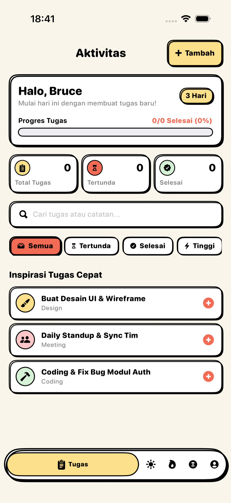
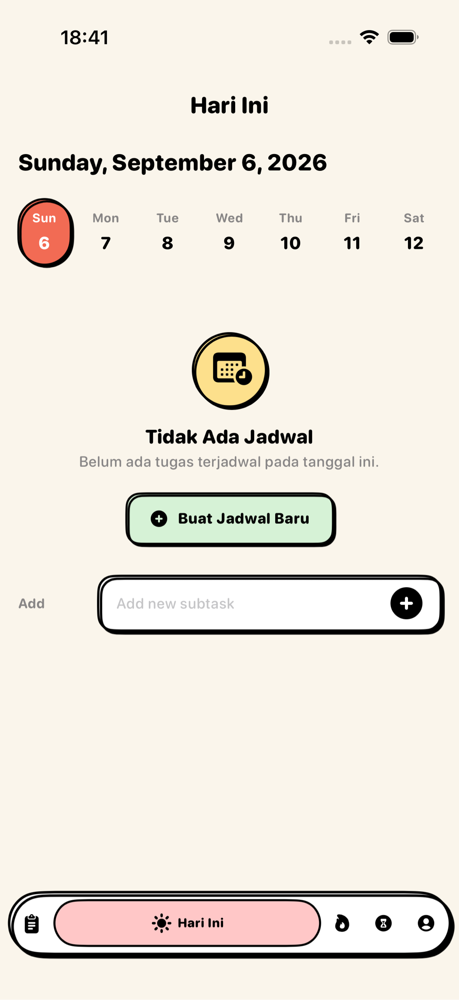
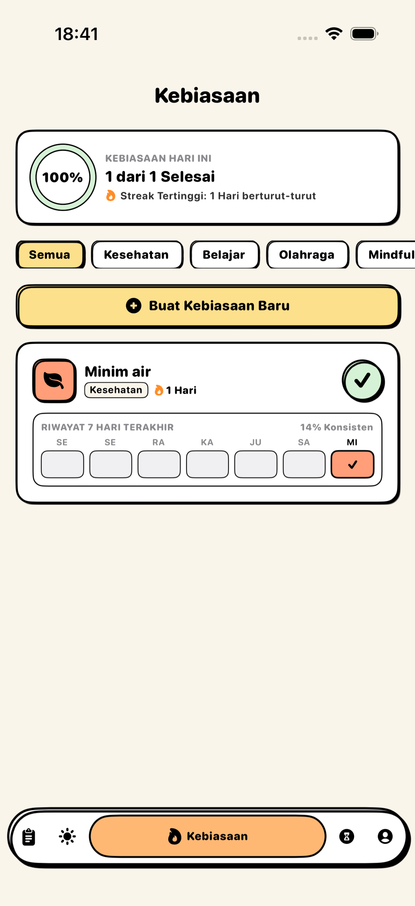
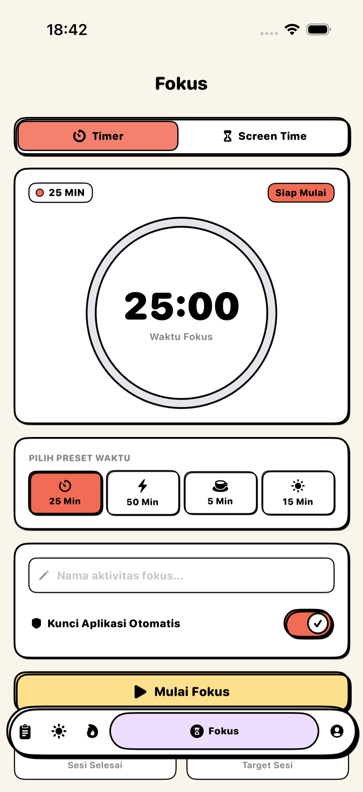
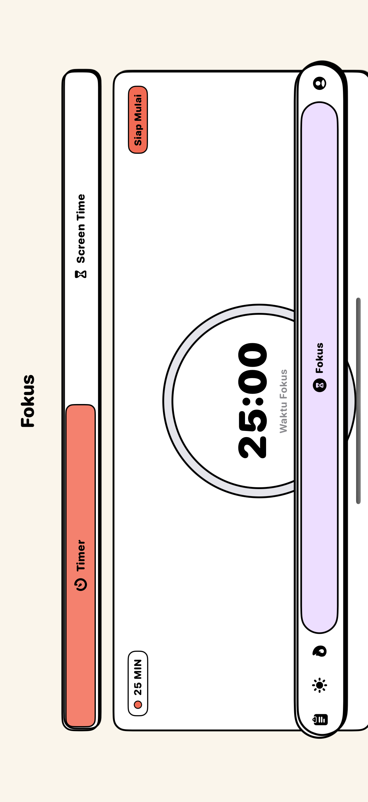

# 📱 Productive Kids / Pop Activity Tracker (iOS)

A playful, feature-packed iOS Productivity, Habit Tracker & Focus application built with **SwiftUI**, **SwiftData**, and **WidgetKit** featuring a bold **Neo-Brutalist / Cartoonish Pop** design aesthetic.

---

## 📸 App Previews & Screenshots

| 📋 Aktivitas & Tugas | ☀️ Timeline Hari Ini | 🔥 Habit Tracker |
| :---: | :---: | :---: |
|  |  |  |

| ⏱️ Fokus & Pomodoro | 👤 Profil & Statistik | ✏️ Edit Profil |
| :---: | :---: | :---: |
|  |  |  |

| 📊 Screen Time & Shield | 📱 Live Activity & Dynamic Island | 🧩 Home Screen Widget |
| :---: | :---: | :---: |
|  |  |  |

---

## ✨ Fitur Unggulan

- **🎨 Neo-Brutalist Pop UI**: Desain kartun pop dengan garis tepi tebal (*bold outlines*), *hard offset shadows*, palet warna pastel cerah, dan umpan balik haptik responsif.
- **📋 Manajemen Tugas & Aktivitas**: Buat, edit, prioritaskan (*Tinggi/Normal/Rendah*), dan filter tugas berdasarkan kategori kartun.
- **☀️ Timeline Hari Ini**: Visualisasi jadwal tugas harian secara kronologis dari pagi hingga malam.
- **🔥 Habit Tracker (Kebiasaan)**: Pantau konsistensi harian dengan penghitung *streak*, *weekly heatmap 7 hari*, dan persentase kelulusan mingguan.
- **⏱️ Fokus Hub & Pomodoro**: Timer Pomodoro terintegrasi dengan opsi istirahat (*Short/Long Break*) dan integrasi pemblokir aplikasi otomatis.
- **📊 Screen Time & App Shielding**: Pelacakan batas waktu penggunaan aplikasi dengan `FamilyControls` & `ManagedSettings`.
- **🧩 WidgetKit & Live Activity**: Widget interaktif di Home Screen dan Dynamic Island / Lock Screen real-time untuk timer fokus.
- **☁️ Sinkronisasi SwiftData & iCloud CloudKit**: Penyimpanan data lokal modern dan pencadangan otomatis multi-perangkat via CloudKit.
- **🔐 Keamanan & Preferensi**: Kunci aplikasi biometrik (*Face ID / Touch ID*), pengingat rutin harian (*Daily Morning & Evening Reminders*), dan kustomisasi avatar profil.

---

## 📂 Struktur Proyek

```text
learning/
├── App/
│   └── learningApp.swift             # Entry point, ModelContainer & CloudKit Setup
├── Models/
│   ├── Item.swift                    # SwiftData Model Aktivitas / Tugas
│   ├── Habit.swift                   # SwiftData Model Kebiasaan & Streaks
│   └── PomodoroAttributes.swift      # ActivityAttributes untuk Live Activity
├── Views/
│   ├── Activities/                   # Layar Manajemen Tugas & Timeline
│   ├── Habits/                       # Layar Pelacak Kebiasaan & Form Habit
│   ├── Focus/                        # Layar Timer Pomodoro & Focus Hub
│   ├── Tracking/                     # Layar Screen Time & App Tracking
│   ├── Profile/                      # Layar Profil, Edit Profil & Pengaturan
│   ├── Auth/                         # Splash Screen, Login & Register
│   ├── Components/                   # Komponen Kartun (Header, Toggle, Button, Dialog)
│   └── Navigation/                   # ContentView & 5-Tab Custom Bottom Bar
├── Services/                         # Pengelola Notifikasi, Haptik, Screen Time, dll.
├── TaskWidget/                       # WidgetKit Extension & Live Activity
└── DeviceActivityReport/             # ExtensionKit untuk Laporan Screen Time
```

---

## 🛠️ Persyaratan & Dependensi

| Komponen | Spesifikasi |
| :--- | :--- |
| **Bahasa** | Swift 5.10 / Swift 6 |
| **Framework UI** | SwiftUI |
| **Database** | SwiftData (CloudKit Enabled) |
| **Platform Minimum** | iOS 17.0+ / iPadOS 17.0+ |
| **IDE** | Xcode 15.4+ / Xcode 16+ (macOS Sonoma / Sequoia) |

---

## 🚀 Cara Menjalankan Proyek

1. **Clone repository:**
   ```bash
   git clone https://github.com/USERNAME/learning-ios.git
   cd learning-ios
   ```

2. **Buka Project di Xcode:**
   ```bash
   open learning.xcodeproj
   ```

3. **Build & Jalankan:**
   - Pilih Simulator iPhone (contoh: `iPhone 16 Pro`).
   - Tekan `Cmd + R` untuk kompilasi dan menjalankan aplikasi.

---

## 👨‍💻 Author

- **Herlambang**
